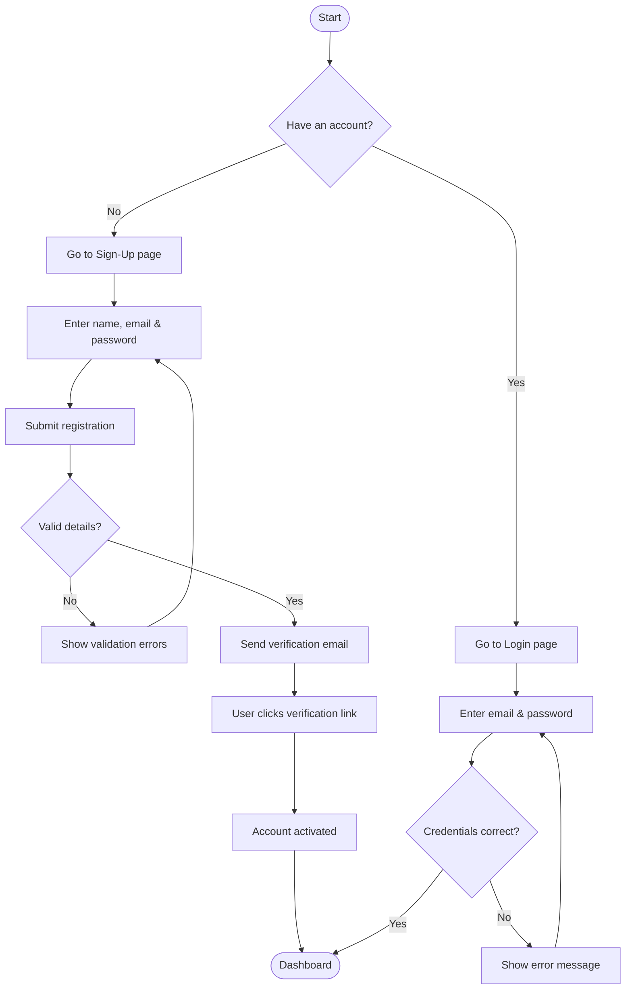
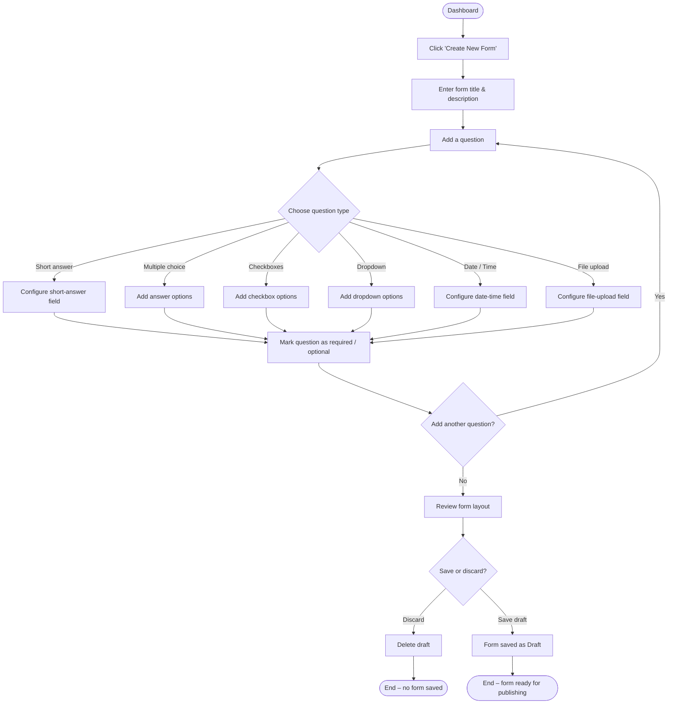
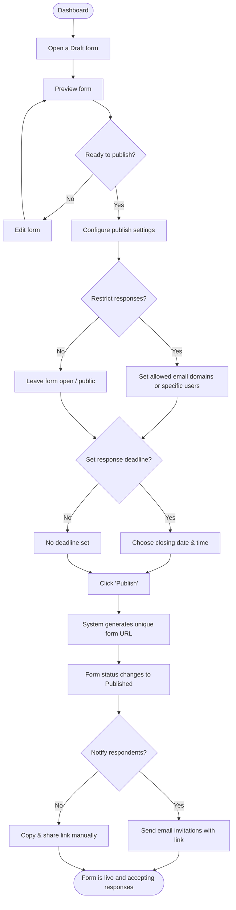
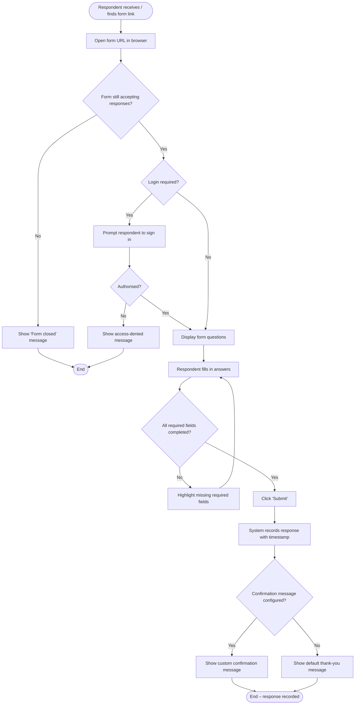
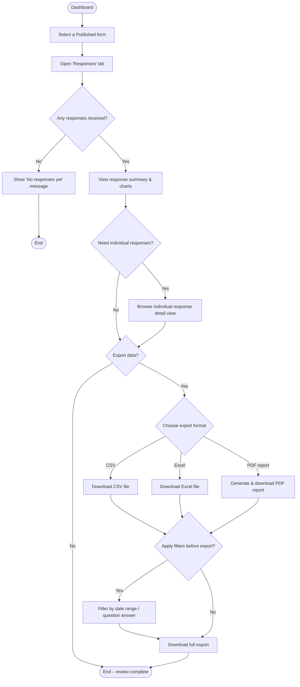
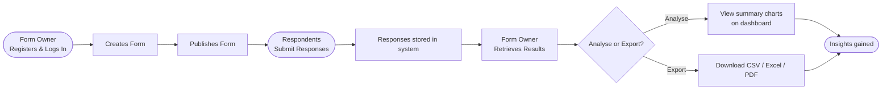

# Online Forms System – Flow Diagrams

The following Mermaid diagrams describe the key user journeys in an online forms system.

---

## 1. User Registration & Login Flow

---

## 2. Form Creation Flow

---

## 3. Form Publishing Flow

---

## 4. Form Submission Flow (Respondent)

---

## 5. Form Results Retrieval Flow (Form Owner)

---

## 6. End-to-End Overview

